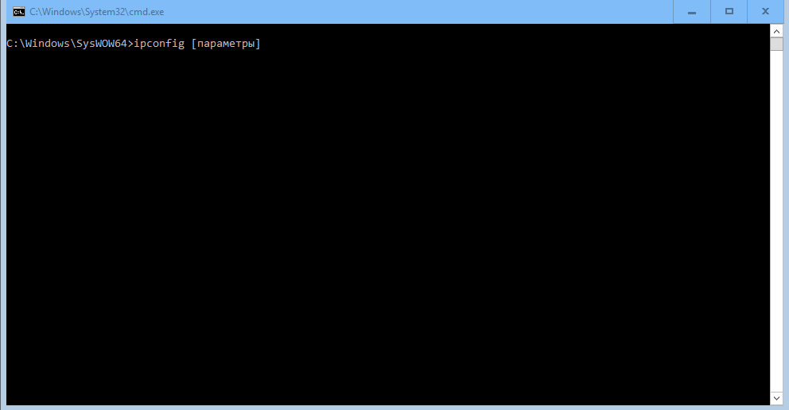
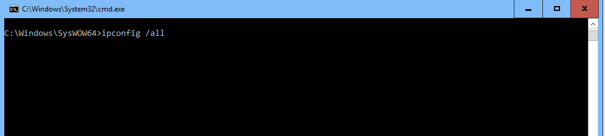
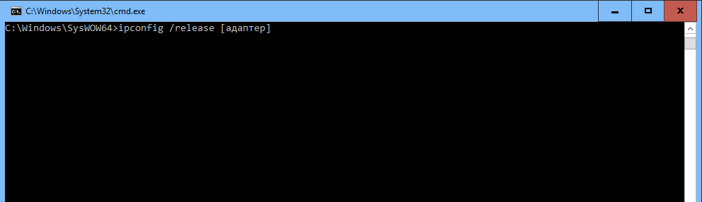
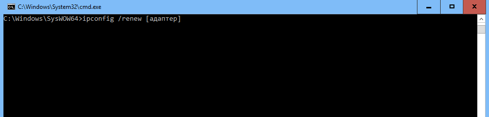
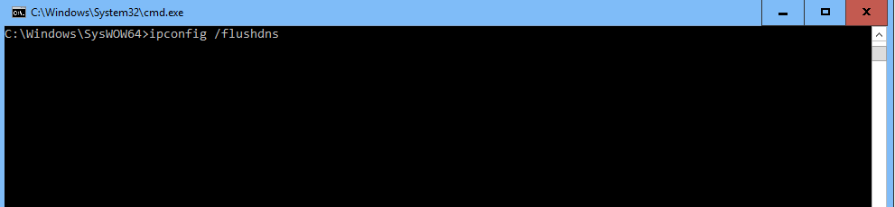
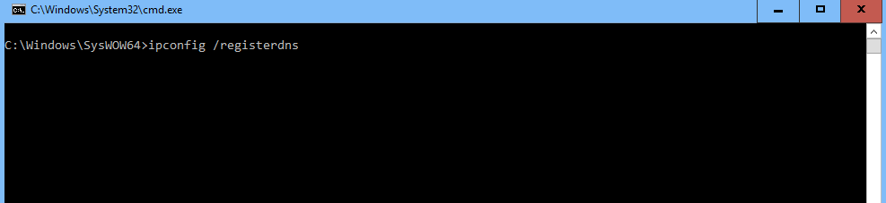
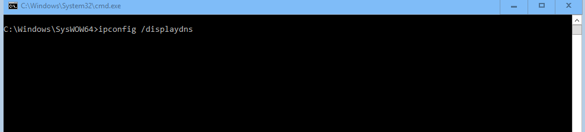
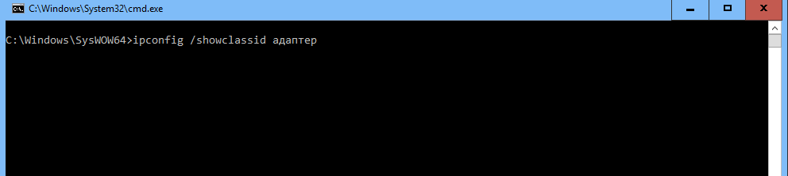
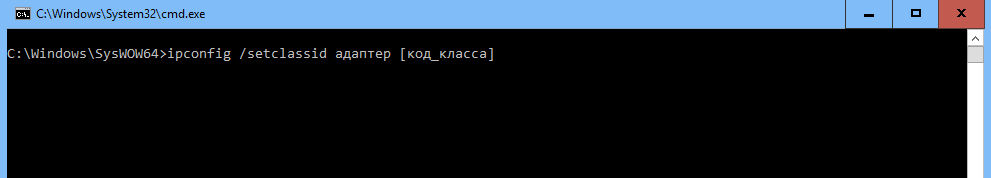
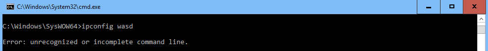

# УТИЛИТА IPCONFIG КОМАНДНОЙ СТРОКИ CMD
## Техническое задание
# СОДЕРЖАНИЕ

[1. Введение](#1-введение)

[1.1. Наименование](#11-наименование)

[1.2. Краткая характеристика области применения](#12-краткая-характеристика-области-применения)

[2. Основания для разработки](#2-основания-для-разработки)

[2.1. Основание для проведения разработки](#21-основание-для-проведения-разработки)

[2.2. Наименование и условное обозначение темы разработки](#22-наименование-и-условное-обозначение-темы-разработки)

[3. Назначение разработки](#3-назначение-разработки)

[3.1. Функциональное назначение](#31-функциональное-назначение)

[3.2. Эксплуатационное назначение](#32-эксплуатационное-назначение)

[4. Требования к программе](#4-требования-к-программе)

[4.1. Требования к функциональным характеристикам](#41-требования-к-функциональным-характеристикам)

[4.1.1. Требования к составу выполняемых функций](#411-требования-к-составу-выполняемых-функций)

[4.1.2. Требования к организации входных и выходных данных](#412-требования-к-организации-входных-и-выходных-данных)

[4.1.3. Требования к временным характеристикам](#413-требования-к-временным-характеристикам)

[4.2. Требования к надежности](#42-требования-к-надежности)

[4.2.1. Требования к обеспечению устойчивого функционирования](#421-требования-к-обеспечению-устойчивого-функционирования)

[4.2.2. Контроль входной и выходной информации](#422-контроль-входной-и-выходной-информации)

[4.2.3. Время восстановления после отказа](#423-время-восстановления-после-отказа)

[4.3. Условия эксплуатации](#43-условия-эксплуатации)

[4.3.1. Климатические условия эксплуатации](#431-климатические-условия-эксплуатации)

[4.3.2. Требования к видам обслуживания](#432-требования-к-видам-обслуживания)

[4.3.3. Требования к численности и квалификации персонала](#433-требования-к-численности-и-квалификации-персонала)

[4.4. Требования к составу и параметрам технических средств](#44-требования-к-составу-и-параметрам-технических-средств)

[4.5. Требования к информационной и программной совместимости](#45-требования-к-информационной-и-программной-совместимости)

[4.5.1. Требования к информационным структурам и методам решения](#451-требования-к-информационным-структурам-и-методам-решения)

[4.5.2. Требования к исходным кодам и языкам программирования](#452-требования-к-исходным-кодам-и-языкам-программирования)

[4.5.3. Требования к программным средствам, используемых программой](#453-требования-к-программным-средствам-используемых-программой)

[4.5.4. Требования к защите информации и программ](#454-требования-к-защите-информации-и-программ)

[4.6. Требования к маркировке и упаковке](#46-требования-к-маркировке-и-упаковке)

[4.7. Требования к транспортировке и хранению](#47-требования-к-транспортировке-и-хранению)

[4.8. Специальные требования](#48-специальные-требования)

[5. Требования к программной документации](#5-требования-к-программной-документации)

[5.1. Предварительный состав программной документации](#51-предварительный-состав-программной-документации)

[5.2. Системные требования к программной документации](#52-системные-требования-к-программной-документации)

[6. Технико-экономические показатели](#6-технико-экономические-показатели)

[6.1. Ориентировочная экономическая эффективность](#61-ориентировочная-экономическая-эффективность)

[6.2. Предполагаемая годовая потребность](#62-предполагаемая-годовая-потребность)

[6.3. Экономические преимущества разработки](#63-экономические-преимущества-разработки)

[7. Стадии и этапы разработки](#7-стадии-и-этапы-разработки)

[7.1. Стадии разработки](#71-стадии-разработки)

[7.2. Этапы разработки](#72-этапы-разработки)

[7.3. Содержание работ по этапам](#73-содержание-работ-по-этапам)

[8. Порядок контроля и приемки](#8-порядок-контроля-и-приемки)

[8.1. Виды испытаний](#81-виды-испытаний)

[8.2. Общие требования к приемке работы](#82-общие-требования-к-приемке-работы)

# 1. Введение
## 1.1. Наименование
Наименование – «Утилита IPCONFIG командной строки CMD».
## 1.2 Краткая характеристика области применения
Утилита IPCONFIG используется для вывода деталей текущего соединения и управления клиентскими сервисами DHCP и DNS.

# 2. Основания для разработки
## 2.1. Основание для проведения разработки
Основанием для проведения разработки является лабораторная работа №1 по дисциплине «Технология разработки программного обеспечения АСОИУ». Лабораторная работа Утверждена Сувальским А. А., в дальнейшем именуемым Заказчиком. Дата утверждения — 11.09.20.
## 2.2. Наименование и условное обозначение темы разработки
Наименование темы разработки — «Разработка утилиты IPCONFIG».
Условное обозначение темы разработки — «К.В.0012».

# 3. Назначение разработки
## 3.1. Функциональное назначение
Функциональным назначением утилиты является вывод деталей текущего соединения и управления клиентскими сервисами DHCP и DNS.
## 3.2. Эксплуатационное назначение
Утилита IPCONFIG должна эксплуатироваться в интерпретаторе командной строки компьютера.

# 4. Требования к программе
## 4.1. Требования к функциональным характеристикам
### 4.1.1 Требования к составу выполняемых функций
Утилита IPCONFIG должна уметь выполнять следующие функции:
1. отображение полной конфигурации сетевого адаптера;
2. освобождения текущей конфигурации DHCP и удаления конфигурации IP-адресов;
3. обновление IP-адреса;
4. очистка DNS кэша;
5. обновление всех зарезервированных адресов DHCP и перерегистрация имен DNS;
6. отображение содержимого кэша DNS;
7. отображение кода класса DHCP;
8. изменение кода класса DHCP;
### 4.1.2 Требования к организации входных и выходных данных
4.1.2.1. Утилита должна иметь структуру, изображенную на рисунке 1.

Рисунок 1 - Структура команды IPCONFIG
Все параметры для работы с IPv6 адресами имеют дублирующий параметр с добавленным символом 6 в конце.

4.1.2.2. Отображение полной информации:
1. Параметр /all задает режим работы на отображение полной информации о сетевой конфигурации компьютера. Данная форма команды IPCONFIG приведена на рисунке 2; 

Рисунок 2 - Синтаксис команды IPCONFIG с параметром /all
4.1.2.3. Освобождение текущей конфигурации DHCP и удаление конфигурации IP-адресов. 
1. Параметр /release задает режим работы на освобождение текущей конфигурации DHCP и удаления конфигурации IP-адресов. Данная форма команды IPCONFIG приведена на рисунке 3;

Рисунок 3 - Синтаксис команды  с параметром /release
2. Если после параметра не указано имя адаптера, то команда будет применена для всех адаптеров, присутствующих в системе. 
3. Для работы с адресами IPv6 параметр изменяется на /release6 (добавляется 6 в конце)
4.1.2.4 Обновление IP-адреса 
1. Параметр /renew задает режим работы на обновление IP-адреса.
Данная форма команды IPCONFIG приведена на рисунке 4;

Рисунок 4 - Синтаксис команды IPCONFIG с параметром /renew

2. Если после параметра не указано имя адаптера, то команда будет применена для всех адаптеров, присутствующих в системе. 
3. Для работы с адресами IPv6 параметр изменяется на /renew6 (добавляется 6 в конце)
4.1.2.5. Очистка DNS кэша
1.	Параметр /flushdns задает режим работы на очистку DNS кэша. Данная форма команды IPCONFIG приведена на рисунке 5;

Рисунок 5 - Синтаксис команды IPCONFIG с параметром /flushdns

4.1.2.6. Обновление всех зарезервированных адресов DHCP и перерегистрация имен DNS.
1. Параметр /registerdns задает режим работы на обновление всех зарезервированных адресов DHCP и перерегистрацию имен. Данная форма команды IPCONFIG приведена на рисунке 6;

Рисунок 6 - Синтаксис команды IPCONFIG с параметром /registerdns.

4.1.2.7 Отображение содержимого кэша DNS
1. Параметр /displaydns задает режим работы на отображение содержимого кэша DNS. Данная форма команды IPCONFIG приведена на рисунке 7;

Рисунок 7 - Синтаксис команды IPCONFIG с параметром /registerdns.

4.1.2.8. Отображение кода класса DHCP для указанного адаптера 
1. Параметр /showclassid задает режим работы на отображение кода класса DHCP. Данная форма команды IPCONFIG приведена на рисунке 8;

Рисунок 8 - Синтаксис команды IPCONFIG с параметром /showclassid

2. Указание названия сетевого адаптера обязательно.
3. Для работы с адресами IPv6 параметр изменяется на /showclassid6 (добавляется 6 в конце)

4.1.2.9. Изменение кода класса DHCP для указанного адаптера 
1. Параметр /setclassid задает режим работы на изменение кода класса DHCP. Данная форма команды IPCONFIG приведена на рисунке 8;

Рисунок 9 - Синтаксис команды IPCONFIG с параметром /setclassid

2. Указание названия сетевого адаптера обязательно.
3. Для работы с адресами IPv6 параметр изменяется на /setclassid6 (добавляется 6 в конце)

### 4.1.3. Требования к временным характеристикам
Требования к временным характеристикам программы не предъявляются.
## 4.2. Требования к надежности
### 4.2.1. Требования к обеспечению устойчивого функционирования
Устойчивое функционирование программы должно быть обеспечено выполнением совокупности организационно-технических мероприятий:
1. необходимым уровнем квалификации сотрудников профильных подразделений;
2. организацией бесперебойного питания технических средств;
3. выполнением рекомендаций Министерства труда и социального развития РФ, изложенных в Постановлении от 23 июля 1998 г. «Об утверждении межотраслевых типовых норм времени на работы по сервисному обслуживанию ПЭВМ и оргтехники и сопровождению программных средств» и требований ГОСТ 51188-98. Защита информации. Испытания программных средств на наличие компьютерных вирусов.
### 4.2.2 Контроль входной и выходной информации
В случае некорректного ввода команды IPCONFIG будет выведено следующее сообщение, показанное на рисунке 11.

Рисунок 11 - Сообщение команды IPCONFIG при ошибке
### 4.2.3. Время восстановления после отказа
Время восстановления после отказа должно не превышать 20 мин.
## 4.3. Условия эксплуатации
### 4.3.1. Климатические условия эксплуатации
Программа должна работать в закрытых помещениях и при нормальных климатических условиях. Температура окружающего воздуха должна быть в диапазоне 15-25 градусов, относительная влажность на уровне 40-60%.
### 4.3.2. Требования к видам обслуживания
Проводится периодическое тестирование программы, раз в 6 месяцев.
### 4.3.3. Требования к численности и квалификации персонала
Минимальное количество персонала, требуемого для работы программы, должно составлять не менее двух штатных единиц – системный программист и конечный пользователь.
Системный программист должен иметь минимум среднее техническое образование. В перечень задач, выполняемых системным программистом, должны входить:
1. Задача поддержания работоспособности технических средств;
2. Задача установки и поддержания работоспособности системного программного средства – операционной системы;
3. Задача установки программы.
Конечный пользователь программы должен уметь работать с интерфейсом операционной системы.
## 4.4. Требования к составу и параметрам технических средств
В состав технических средств должен входить персональный компьютер (ПЭВМ), включающий в себя:
1. процессор с таковой частотой не менее 300 МГц;
2. оперативную память объемом не менее 128 Мб;
3. жесткий диск объемом 1,5 Гб и выше.
## 4.5. Требования к информационной и программной совместимости
### 4.5.1. Требования к информационным структурам и методам решения
Требования к информационным структурам и методам решения не предъявляются.
### 4.5.2. Требования к исходным кодам и языкам программирования
Исходные коды программы должны быть реализованы в пакетном файле или непосредственно в интерпретаторе командной строки CMD.
### 4.5.3. Требования к программным средствам, используемых программой
Должна использоваться командная строка, встроенная в операционную систему Windows 10.
### 4.5.4. Требования к защите информации и программ
Требования к защите информации и программ не предъявляются.
## 4.6. Требования к маркировке и упаковке
Требования к маркировке и упаковке не предъявляются.
## 4.7. Требования к транспортировке и хранению
Требования к транспортировке и хранению не предъявляются.
## 4.8. Специальные требования
Специальные требования к программе не предъявляются.

# 5 ТРЕБОВАНИЯ К ПРОГРАММНОЙ ДОКУМЕНТАЦИИ
## 5.1. Предварительный состав программной документации
Состав программной документации должен включать в себя:
1. техническое задание;
2. спецификация;
3. текст программы;
4. описание программы;
5. программу и методики испытаний;
6. пояснительную записку;
7. ведомость эксплуатационных документов;
8. формуляр;
9. описание применения;
10. руководство системного программиста;
11. руководство конечного пользователя.
## 5.2. Системные требования к программной документации
Системные требования к программной документации не предъявляются.

# 6 ТЕХНИКО-ЭКОНОМИЧЕСКИЕ ПОКАЗАТЕЛИ
## 6.1. Ориентировочная экономическая эффективность
Ориентировочная экономическая эффективность не рассчитывается.
## 6.2. Предполагаемая годовая потребность
Предполагаемая годовая потребность не рассчитывается.
## 6.3. Экономические преимущества разработки
Экономические преимущества разработки не рассчитываются.

# 7 СТАДИИ И ЭТАПЫ РАЗРАБОТКИ
## 7.1. Стадии разработки
Разработка должна быть проведена в три стадии:
1. разработка технического задания;
2. рабочее проектирование;
3. внедрение.
## 7.2. Этапы разработки
На стадии разработки технического задания должен быть выполнен этап разработки, согласования и утверждения между Заказчиком и Исполнителем настоящего технического задания.
На стадии рабочего проектирования должны быть выполнены следующие этапы работ:
1. разработка программы;
2. разработка программной документации;
3. испытания программы.
На стадии внедрения должен быть выполнен этап разработки – подготовка и передача программы.
## 7.3. Содержание работ по этапам
На этапе разработки технического задания должны быть выполнены следующие виды работ:
1. постановка задачи;
2. определение и уточнение требований к техническим средствам;
3. определение требований к программе;
4. определение стадий, этапов и сроков разработки программы и документации на неё;
5. выбор языков программирования;
6. согласование и утверждение технического задания.
На этапе разработки программы должна быть выполнена работа по программированию и отладке программы.
На этапе разработки программной документации должна быть выполнена разработка программных документов в соответствии с требованиями ГОСТ 19.101-77 разработка и требованием п. «Предварительный состав программной документации» настоящего технического задания.
На этапе испытаний программы должны быть выполнены следующие виды работ:
1. разработка, согласование и утверждение программы и методики испытаний;
2. проведение приемо-сдаточных испытаний;
3. корректировка программы и программной документации по результатам испытаний.
На этапе подготовки и передачи программы должна быть выполнена работа по подготовке и передаче программы и программной документации в эксплуатацию на объектах Заказчика.

# 8. ПОРЯДОК КОНТРОЛЯ И ПРИЕМКИ
## 8.1. Виды испытаний
Приемо-сдаточные испытания программы должны проводиться согласно разработанной Исполнителем и согласованной Заказчиком «Программы и методики испытаний».
Ход проведения приемо-сдаточных испытаний Заказчик и Исполнитель документируют в Протоколе проведения испытаний.
## 8.2. Общие требования к приемке работы
После проведения испытаний в полном объеме, на основании «Протокола испытаний» утверждают «Свидетельство о приемке» и производят запись в программном документе «Формуляр».